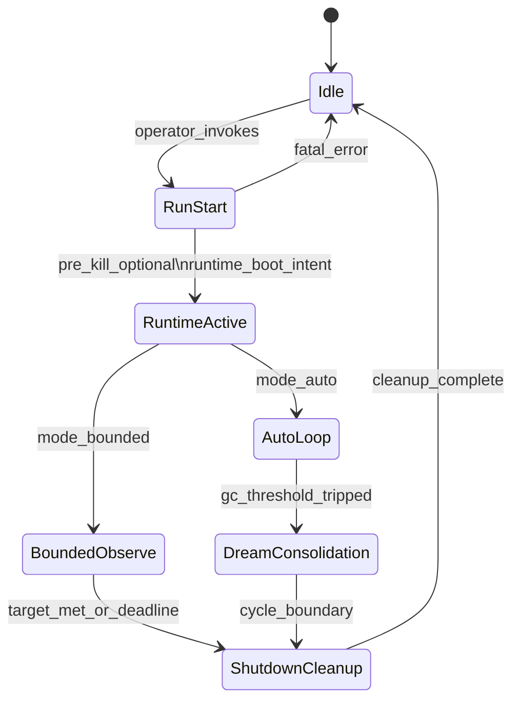

# FSAA / AIOA supervisor state machine

This describes the **brainstem supervisor** (`fsaa.control_plane.supervisor`) and how it relates to the AIOS runtime. Operator intent is limited to **envelope, duration, and safety**; **action choice** remains inside AIOS.

## Actors

| Actor | Role |
| --- | --- |
| `operator` | Starts/stops runs, sets flags (`--auto`, `--loop`, thresholds). |
| `supervisor` | Supervisor process: lifecycle, IPC authority commits, phase logging. |
| `luna_left` / `aria_right` | Hemisphere entrypoints under `WORKSPACE_ROOT` (see `FsaaPaths.luna_runtime_main` / `aria_runtime_main`). |
| `runner` | Harnesses (e.g. `fsaa.experiments.ab_harness`) when they commit envelopes. |

## States (supervisor)

### State notes

- **Idle**: no supervised child for this run.
- **RunStart**: `run_id` allocated; optional `pre_kill` of stale side processes.
- **RuntimeActive**: child process running (sidecar or turn-token mode).
- **BoundedObserve** (non-`--auto`): wait until **minimum observed non-idle actions** (see packaged `reflex_policy.json`) or **loop deadline**; then force stop.
- **AutoLoop** (`--auto`): monitor until memory threshold; then dream consolidation hook; then kill and optional restart.
- **DreamConsolidation**: external `chat.py` timer hook for consolidation (threshold path only).
- **ShutdownCleanup**: kill side processes, `gc.collect()`, log `outcome`.

## Transitions (triggers)

| From | Trigger | To |
| --- | --- | --- |
| Idle | CLI start | RunStart |
| RunStart | `guarded_commit` intent ok | RuntimeActive |
| RuntimeActive | `auto=false` | BoundedObserve |
| RuntimeActive | `auto=true` | AutoLoop |
| BoundedObserve | `bounded_target` satisfied OR time bound | ShutdownCleanup |
| AutoLoop | `mem_mb >= gc_threshold_mb` | DreamConsolidation |
| AutoLoop | child exit OR outer timeout | ShutdownCleanup |
| DreamConsolidation | timer + sleep | ShutdownCleanup |
| ShutdownCleanup | phases logged | Idle |

## Invariants (must not violate)

1. **No silent restart** in bounded mode: `--auto` is off unless explicitly passed.
2. **Single-writer IPC**: envelopes go through `guarded_commit` (`fsaa.policy.guard`).
3. **Evidence**: phase rows append to `${WORKSPACE_ROOT}/automation/fsaa_supervisor_events.jsonl` (or `FSAA_OBSERVABILITY_DIR`); IPC commits also append to authority and translation logs under the observability directory.
4. **Kill boundary**: after a bounded or auto cycle, supervisor attempts to clear matching side runtime processes before the next launch when `kill_existing` is true.

## Mapping: CLI to mode

| Mode | Flags | Semantics |
| --- | --- | --- |
| Bounded default | `python -m fsaa.cli.entrypoint` | `loop` × `beat-seconds` max window; stop after min observed actions. |
| Bounded custom | `--loop N` `--beat-seconds B` `--min-actions-per-run M` | Same, tuned. |
| Auto | `--auto` `--gc-threshold-mb` … | Run until threshold; dream hook; cleanup; restart until `auto-max-cycles`. |

## Related modules

- `fsaa.control_plane.supervisor`
- `fsaa.resources` (`ipc_schema.json`, `reflex_policy.json`)
- Observability JSONL under `${WORKSPACE_ROOT}/automation/` (default)
